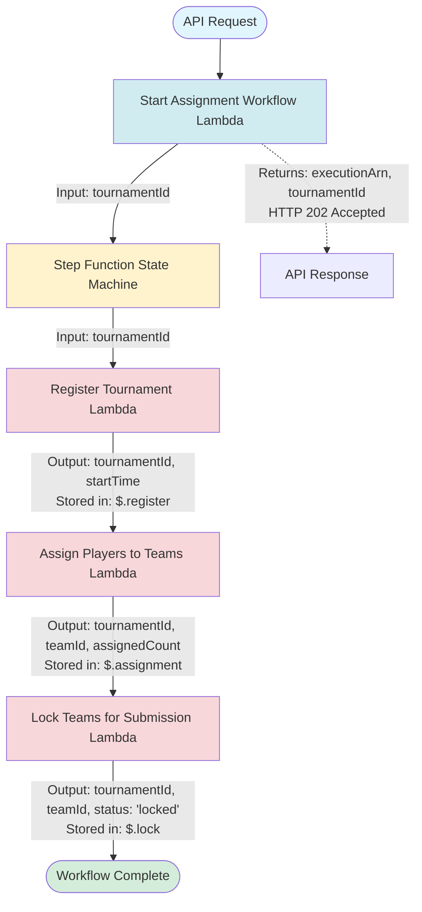
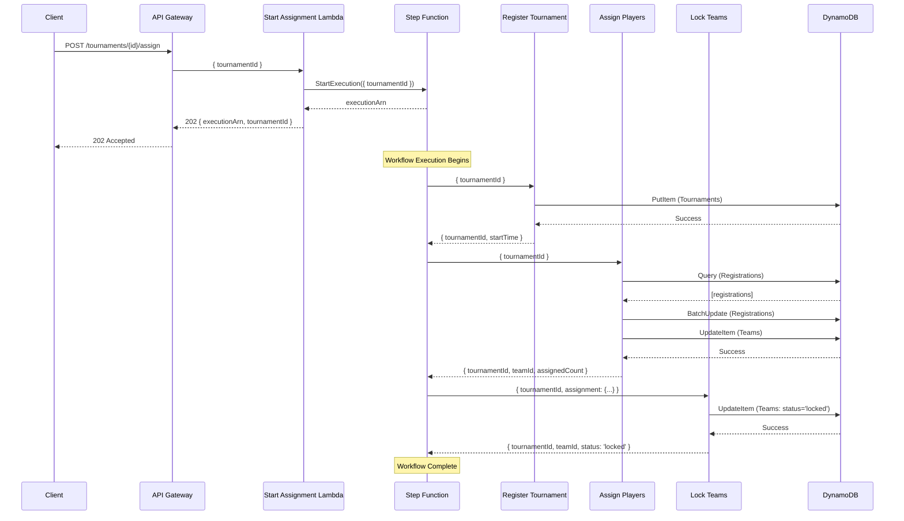

# ClashBot 5.0

A tournament management system for League of Legends Clash, built with Flutter frontend and AWS backend services.

## Architecture Overview

ClashBot uses AWS Step Functions to orchestrate the tournament assignment workflow. The workflow is triggered via API Gateway and executes three sequential Lambda functions to register tournaments, assign players to teams, and lock teams for submission.

## Step Function Workflow

The assignment workflow is orchestrated by an AWS Step Functions state machine that executes the following steps sequentially:



## Workflow Details

### 1. Start Assignment Workflow (Lambda)

**Trigger:** HTTP POST to `/tournaments/{id}/assign`

**Input:**
```json
{
  "tournamentId": "string"
}
```

**Output:**
```json
{
  "statusCode": 202,
  "body": {
    "executionArn": "arn:aws:states:...",
    "tournamentId": "string"
  }
}
```

**Description:** Validates the tournament ID and starts the Step Function execution. Returns immediately with the execution ARN (asynchronous processing).

---

### 2. Register Tournament (Step Function Step 1)

**Lambda Function:** `registerTournament`

**Input from Step Function:**
```json
{
  "tournamentId": "string"
}
```

**Output (stored in `$.register`):**
```json
{
  "tournamentId": "string",
  "startTime": "2024-01-01T00:00:00.000Z"
}
```

**Description:** Creates or updates the tournament record in DynamoDB with status 'upcoming'.

**DynamoDB Operation:**
- Table: `ClashTournaments`
- Action: `PutItem`
- Sets: `tournamentId`, `startTime`, `status: 'upcoming'`

---

### 3. Assign Players to Teams (Step Function Step 2)

**Lambda Function:** `assignPlayersToTeams`

**Input from Step Function:**
```json
{
  "tournamentId": "string"
}
```

**Output (stored in `$.assignment`):**
```json
{
  "tournamentId": "string",
  "teamId": "team-{tournamentId}",
  "assignedCount": 5
}
```

**Description:** 
- Queries all registrations for the tournament
- Assigns all players to a single team (placeholder implementation)
- Updates registration records with `status: 'assigned'` and `teamId`
- Creates/updates team record with `status: 'open'`

**DynamoDB Operations:**
- Query `ClashRegistrations` table by `tournamentId`
- Update each registration: `status = 'assigned'`, `teamId = 'team-{tournamentId}'`
- Update `ClashTeams` table: `status = 'open'`

---

### 4. Lock Teams for Submission (Step Function Step 3)

**Lambda Function:** `lockTeamsForSubmission`

**Input from Step Function:**
```json
{
  "tournamentId": "string",
  "assignment": {
    "teamId": "team-{tournamentId}",
    "assignedCount": 5
  }
}
```

**Output (stored in `$.lock`):**
```json
{
  "tournamentId": "string",
  "teamId": "team-{tournamentId}",
  "status": "locked"
}
```

**Description:** Locks the team to prevent further modifications before tournament submission.

**DynamoDB Operation:**
- Table: `ClashTeams`
- Action: `UpdateItem`
- Sets: `status = 'locked'`

---

## Complete Step Function State

After all steps complete, the Step Function state contains:

```json
{
  "tournamentId": "string",
  "register": {
    "tournamentId": "string",
    "startTime": "2024-01-01T00:00:00.000Z"
  },
  "assignment": {
    "tournamentId": "string",
    "teamId": "team-{tournamentId}",
    "assignedCount": 5
  },
  "lock": {
    "tournamentId": "string",
    "teamId": "team-{tournamentId}",
    "status": "locked"
  }
}
```

## Error Handling

- Each Lambda function throws errors that cause the Step Function to fail
- The Step Function has a timeout of 5 minutes
- Failed executions can be inspected via the execution ARN returned in the initial API response

## Data Flow Diagram



## Infrastructure

The Step Function and all Lambda functions are defined in `infra/lib/clashbot-infra-stack.ts` using AWS CDK.

### Key Resources:
- **State Machine:** `AssignmentWorkflow` (5 minute timeout)
- **Lambda Functions:**
  - `StartAssignmentWorkflowFn` - Triggers the workflow
  - `RegisterTournamentFn` - Step 1
  - `AssignPlayersToTeamsFn` - Step 2
  - `LockTeamsForSubmissionFn` - Step 3

### DynamoDB Tables:
- `ClashTournaments` - Tournament metadata
- `ClashRegistrations` - Player registrations
- `ClashTeams` - Team assignments and status

## Frontend

The Flutter frontend can trigger the workflow by calling:
```
POST /tournaments/{tournamentId}/assign
```

The API returns immediately with an `executionArn` that can be used to track the workflow execution status in AWS Step Functions console.

