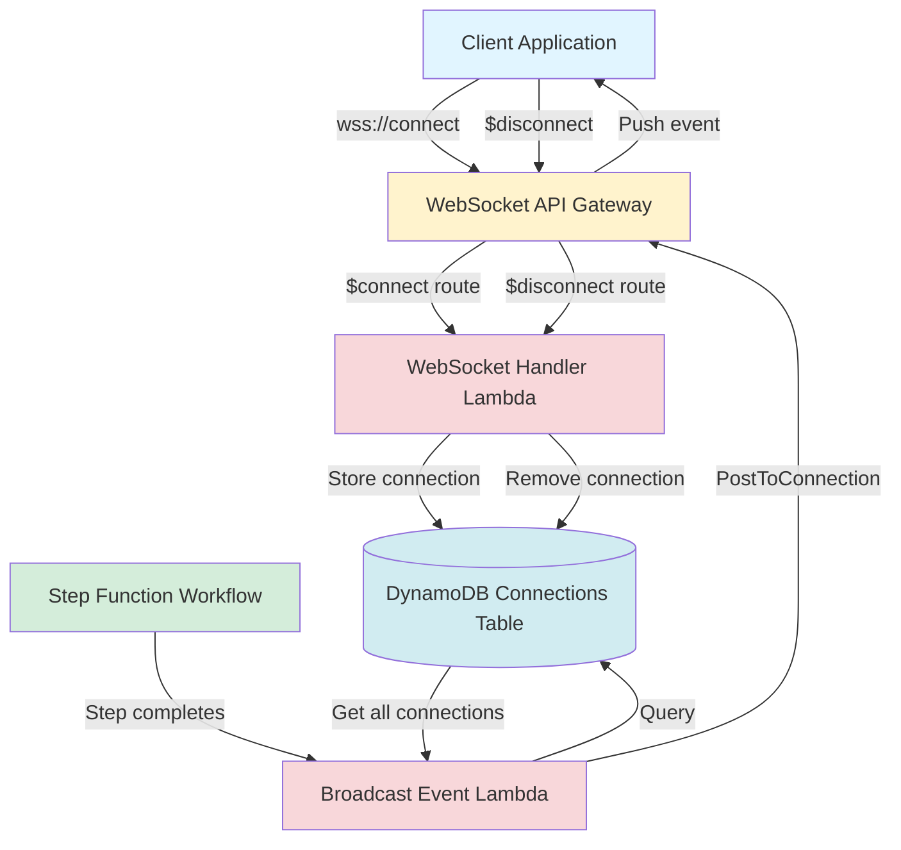
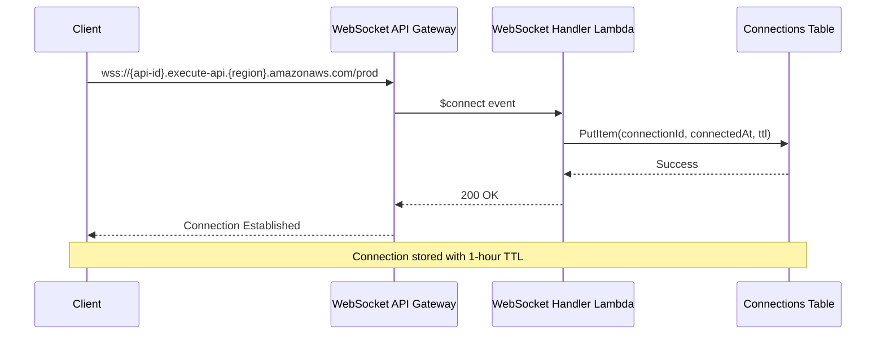
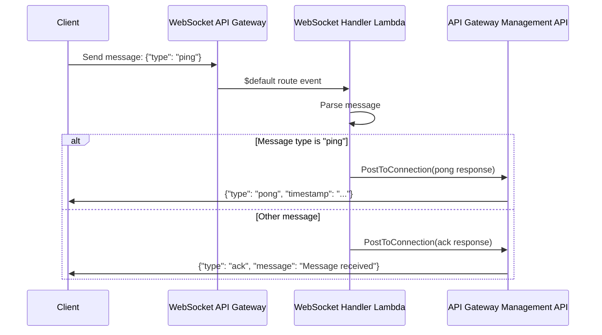
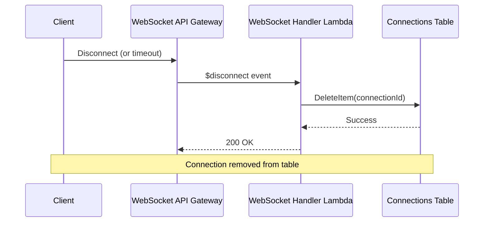
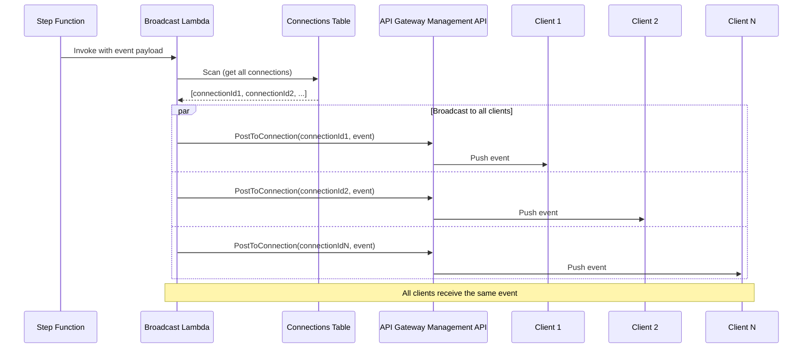
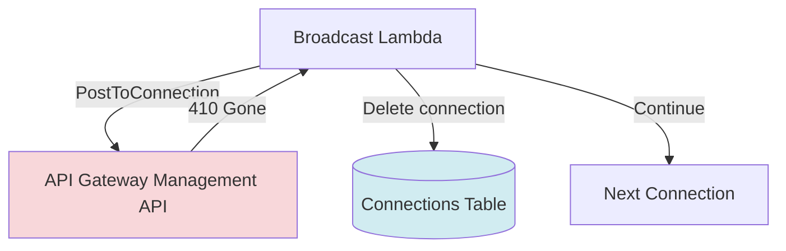

# WebSocket Real-Time Events

This document describes the WebSocket implementation for real-time event broadcasting in ClashBot.

## Overview

The WebSocket API enables real-time event notifications to connected clients. When tournament workflows execute, events are automatically broadcast to all connected WebSocket clients, allowing the frontend to update in real-time without polling.

## Architecture



## Connection Lifecycle

### 1. Connection Establishment

When a client connects to the WebSocket endpoint:



**Connection Storage:**
- **Table**: `ClashWebSocketConnections`
- **Key**: `connectionId` (provided by API Gateway)
- **Attributes**:
  - `connectionId`: Unique connection identifier
  - `connectedAt`: ISO timestamp of connection
  - `ttl`: Unix timestamp (1 hour from connection time) for automatic cleanup

### 2. Connection Management

**Connection Table Schema:**
```json
{
  "connectionId": "abc123xyz",
  "connectedAt": "2024-01-01T12:00:00.000Z",
  "ttl": 1704110400
}
```

**TTL (Time To Live):**
- Connections automatically expire after 1 hour
- Prevents stale connections from accumulating
- DynamoDB automatically deletes expired items

### 3. Message Handling

Clients can send messages to the WebSocket API:



**Supported Message Types:**
- `ping` - Returns a `pong` response with timestamp
- Any other message - Returns an `ack` acknowledgment

### 4. Disconnection

When a client disconnects (intentionally or due to network issues):



## Event Broadcasting Flow

### Workflow Integration

The Step Function workflow automatically broadcasts events at each step:

```mermaid
flowchart LR
    Start[Workflow Starts] -->|Broadcast| Event1[workflow.started]
    Event1 --> Register[Register Tournament]
    Register -->|Broadcast| Event2[tournament.registered]
    Event2 --> Assign[Assign Players]
    Assign -->|Broadcast| Event3[players.assigned]
    Event3 --> Lock[Lock Teams]
    Lock -->|Broadcast| Event4[teams.locked]
    Event4 --> End[Workflow Complete]
    
    style Event1 fill:#d4edda
    style Event2 fill:#d4edda
    style Event3 fill:#d4edda
    style Event4 fill:#d4edda
```



### Broadcast Process

When a workflow step completes, the following sequence occurs:



### Event Payload Structure

All broadcast events follow this structure:

```json
{
  "type": "event.type",
  "tournamentId": "tournament-123",
  "data": {
    // Event-specific data
  },
  "timestamp": "2024-01-01T12:00:00.000Z"
}
```

## Event Types

### 1. `workflow.started`

**Triggered:** When a tournament assignment workflow is initiated

**Payload:**
```json
{
  "type": "workflow.started",
  "tournamentId": "tournament-123",
  "data": {
    "tournamentId": "tournament-123",
    "executionArn": "arn:aws:states:..."
  },
  "timestamp": "2024-01-01T12:00:00.000Z"
}
```

**Source:** `startAssignmentWorkflow` Lambda (invokes broadcast asynchronously)

---

### 2. `tournament.registered`

**Triggered:** After the Register Tournament step completes

**Payload:**
```json
{
  "type": "tournament.registered",
  "tournamentId": "tournament-123",
  "data": {
    "tournamentId": "tournament-123",
    "startTime": "2024-01-01T18:00:00.000Z"
  },
  "timestamp": "2024-01-01T12:00:00.000Z"
}
```

**Source:** Step Function invokes `BroadcastEventFn` after `RegisterTournamentTask`

---

### 3. `players.assigned`

**Triggered:** After the Assign Players step completes

**Payload:**
```json
{
  "type": "players.assigned",
  "tournamentId": "tournament-123",
  "data": {
    "tournamentId": "tournament-123",
    "teamId": "team-tournament-123",
    "assignedCount": 5
  },
  "timestamp": "2024-01-01T12:00:05.000Z"
}
```

**Source:** Step Function invokes `BroadcastEventFn` after `AssignPlayersTask`

---

### 4. `teams.locked`

**Triggered:** After the Lock Teams step completes

**Payload:**
```json
{
  "type": "teams.locked",
  "tournamentId": "tournament-123",
  "data": {
    "tournamentId": "tournament-123",
    "teamId": "team-tournament-123",
    "status": "locked"
  },
  "timestamp": "2024-01-01T12:00:10.000Z"
}
```

**Source:** Step Function invokes `BroadcastEventFn` after `LockTeamsTask`

---

## Error Handling

### Stale Connection Cleanup

When broadcasting, if a connection returns a `410 Gone` status:



**Process:**
1. Broadcast Lambda attempts to send event to connection
2. API Gateway returns `410 Gone` (connection no longer exists)
3. Broadcast Lambda removes the stale connection from DynamoDB
4. Continues broadcasting to remaining connections

### Connection TTL

- Connections have a 1-hour TTL in DynamoDB
- DynamoDB automatically deletes expired connections
- Prevents accumulation of stale connection records

## Client Implementation

### Connection

```javascript
// Example WebSocket client connection
const ws = new WebSocket('wss://{api-id}.execute-api.{region}.amazonaws.com/prod');

ws.onopen = () => {
  console.log('Connected to WebSocket');
};

ws.onmessage = (event) => {
  const data = JSON.parse(event.data);
  console.log('Received event:', data);
  
  switch (data.type) {
    case 'workflow.started':
      // Handle workflow started
      break;
    case 'tournament.registered':
      // Handle tournament registered
      break;
    case 'players.assigned':
      // Handle players assigned
      break;
    case 'teams.locked':
      // Handle teams locked
      break;
  }
};

ws.onerror = (error) => {
  console.error('WebSocket error:', error);
};

ws.onclose = () => {
  console.log('WebSocket disconnected');
  // Implement reconnection logic
};
```

### Sending Messages

```javascript
// Send ping to test connection
ws.send(JSON.stringify({ type: 'ping' }));
```

## Infrastructure Components

### Lambda Functions

1. **WebSocketHandlerFn** (`websocketHandler.ts`)
   - Handles `$connect`, `$disconnect`, and `$default` routes
   - Manages connection lifecycle in DynamoDB
   - Processes client messages

2. **BroadcastEventFn** (`broadcastEvent.ts`)
   - Scans all active connections from DynamoDB
   - Broadcasts events to all connections
   - Handles stale connection cleanup

### DynamoDB Table

- **Table Name**: `ClashWebSocketConnections`
- **Partition Key**: `connectionId` (String)
- **TTL Attribute**: `ttl` (Number)
- **Purpose**: Store active WebSocket connections

### API Gateway

- **Type**: WebSocket API (API Gateway v2)
- **Routes**:
  - `$connect` - Connection establishment
  - `$disconnect` - Connection termination
  - `$default` - Message handling
- **Stage**: `prod`

## Performance Considerations

1. **Connection Limits**: API Gateway WebSocket supports up to 100,000 concurrent connections per region
2. **Broadcast Efficiency**: Uses `Promise.allSettled()` to broadcast in parallel
3. **TTL Cleanup**: Automatic DynamoDB TTL prevents stale connection accumulation
4. **Stale Connection Handling**: Automatically removes connections that return 410 errors

## Monitoring

Key metrics to monitor:

- **Active Connections**: Number of items in `ClashWebSocketConnections` table
- **Broadcast Success Rate**: CloudWatch metrics for Broadcast Lambda
- **Connection Errors**: CloudWatch logs for WebSocket Handler Lambda
- **Stale Connection Cleanup**: Count of 410 errors during broadcasts

## Security

- WebSocket API uses AWS IAM for authentication (can be extended with custom authorizers)
- Connections are isolated per API Gateway instance
- No authentication required by default (can be added via custom authorizer Lambda)

## Troubleshooting

### Connection Not Established

1. Check WebSocket endpoint URL format (must use `wss://`)
2. Verify API Gateway stage is deployed
3. Check CloudWatch logs for WebSocket Handler Lambda

### Events Not Received

1. Verify connection is active in DynamoDB
2. Check Broadcast Lambda CloudWatch logs
3. Verify Step Function workflow is executing broadcast steps
4. Check for 410 errors (stale connections)

### High Connection Count

1. Check TTL is working (connections should expire after 1 hour)
2. Verify disconnect handler is removing connections
3. Monitor DynamoDB table size

